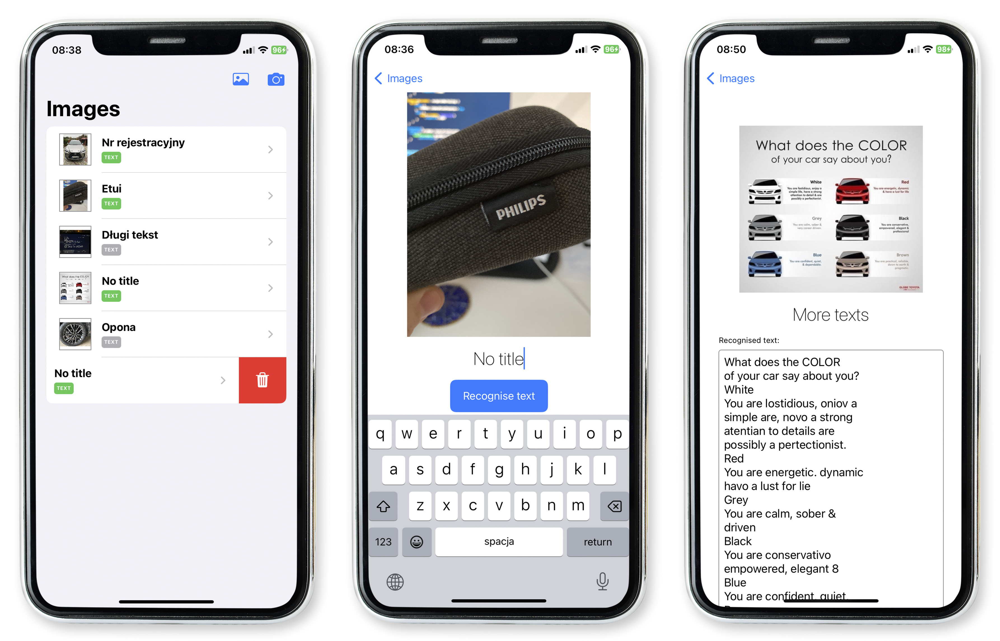

# 2023-01_ImageOCR
Styczeń 2023

## Description:
The main gole of the app is to recognise text from images.
The images and recognised texts are stored in the local device storage, so that the user can look at them later. 

## Technology stack:
* SwiftUI
* Swift 5
* CoreData
* MVVM

## Features:
### 1. Main screen
* presents list of added images, if there are no images a text placeholder is presented
* there are two sources of images:
	* photos library
	* phone camera
* each item on the list consists of three elements:
	* image thumbnail
	* name
	* icon indicating whether the image text has already been recognised
* the user can tap on a row and move to the details and recognition screen
* an item in the list can be deleted by a swipe gesture
* all data is stored in CoreData

### 2. Details screen
On this screen the user can see:

* bigger thumbnail of image
* name of image
* recognised text

Moreover the user can:

* change the name of the image
* start the text recognition process
* remove the recognited text
* scroll the content vertically

All changes made on this screen are reflected on the Main screen.

## Implementation info:
* images are stored in a local data base via CoreData as a *Binary Data* type with the `Allows External Storage` option selected (to improve app performance)
* access to Photo Album could have been done by `UIImagePickerController` just like accessing Phone Camera, however this was intentionally implemented using the new SwiftUI component: `PhotosPicker`